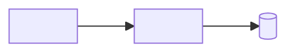

# <Decision-oriented title>
*<System, scope, architectural direction, and delivered outcome>*

**TL;DR:** <One sentence stating what is built, the governing architecture, and the principal cost or risk.>

1. **<Takeaway: the most important architectural and product conclusion.>**
2. **<Takeaway: the key ownership, lifecycle, or correctness invariant.>**
3. **<Takeaway: the principal execution, rollout, or operational consequence.>**

| Goals | Non-goals |
|---|---|
| <Measurable system or user outcome> | <Plausible adjacent outcome intentionally excluded> |
| <Measurable system or user outcome> | <Plausible adjacent outcome intentionally excluded> |

**Priority order:** <priority 1> → <priority 2> → <priority 3>. When these conflict, the earlier priority wins.

## Architecture at a glance

<Caption: what the diagram proves; define unfamiliar terms used in it.>

---

## Table of contents

- [Context and constraints](#context-and-constraints)
- [Principles, priorities, and repository alignment](#principles-priorities-and-repository-alignment)
- [Selected architecture and technical foundation](#selected-architecture-and-technical-foundation)
- [Component contracts](#component-contracts)
- [End-to-end lifecycles](#end-to-end-lifecycles)
- [Interfaces, data, state, and invariants](#interfaces-data-state-and-invariants)
- [Correctness and cross-cutting properties](#correctness-and-cross-cutting-properties)
- [Agent execution contract](#agent-execution-contract)
- [Implementation sequence](#implementation-sequence)
- [Testing and verification](#testing-and-verification)
- [Rollout, rollback, and operations](#rollout-rollback-and-operations)
- [Risks and open gates](#risks-and-open-gates)
- [Definition of done](#definition-of-done)
- [Appendices](#appendices)

## Context and constraints

<State the objective baseline, user or system need, evidence, and binding constraints. Link deep background.>

## Principles, priorities, and repository alignment

**Inherited doctrine:** <links to README, AGENTS.md, CLAUDE.md, architecture guidance, or standards; for a new repository, identify the principles established by this plan>.

**Priority order:**

1. <The first decision rule for this build.>
2. <The second decision rule.>
3. <The third decision rule.>

**Deviations or local interpretations:** <State only deltas. If none, say so in one sentence.>

## Selected architecture and technical foundation

<Explain the chosen system from overview to detail. State the principal cost and link Appendix A for alternatives.>

| Foundation | Selected decision | Constraint or rationale |
|---|---|---|
| Language and runtime | <Choice and version constraint> | <Load-bearing reason> |
| Application frameworks | <Choice and version constraint> | <Load-bearing reason> |
| Persistence and messaging | <Choice and ownership> | <Consistency or lifecycle requirement> |
| Deployment and infrastructure | <Runtime topology and provider boundary> | <Reliability, scale, or operational requirement> |
| Repository structure | <Packages, applications, or modules> | <Dependency direction and ownership rule> |

Omit rows that are immaterial. Do not leave a consequential stack choice to the implementing agent without a bound or stop gate.

## Component contracts

| Component | Responsibility | Owns | Interfaces | Explicitly does not own |
|---|---|---|---|---|
| <Component> | <One sentence> | <State or fact> | <Inputs, outputs, errors> | <Boundary> |

Add component-specific detail only when needed:

### <Component requiring deeper treatment>

| Field | Contract |
|---|---|
| Inputs and outputs | <Requests, events, streams, or artifacts> |
| Owned state and sole writers | <Source of truth, mutation path, retention> |
| Invariants | <Properties this component preserves> |
| Failure behavior | <Detection, durable residue, retry, recovery> |
| Scale and cost | <Binding limits and growth> |
| Observability | <Events, metrics, traces, alerts> |
| Security and privacy | <Trust boundary and sensitive data> |

## End-to-end lifecycles

### <Normal lifecycle>

<Use a sequence diagram, flowchart, or state machine. Define commit points, responses, and owned state.>

### <Failure, retry, or concurrency lifecycle, only when triggered>

<Show ambiguity, durable residue, retry owner, deduplication, ordering, and convergence.>

## Interfaces, data, state, and invariants

<State cross-boundary identifiers, API or event contracts, schemas, sources of truth, writer census, data lifecycle, state transitions, and system-wide invariants. Link canonical definitions instead of copying generated detail.>

## Correctness and cross-cutting properties

<Include only triggered concerns: concurrency, idempotency, failures, security, privacy, reliability, performance, scale, cost, observability, compatibility, and migration. State a conclusion for each included concern.>

## Agent execution contract

### Decision ledger

| Topic | Status | Required behavior | Allowed discretion | Stop and escalate when |
|---|---|---|---|---|
| <Load-bearing choice> | Locked / Bounded / Open / Assumption | <Decision or constraint> | <Local options> | <Gate> |

### Target build map

| Area | Target package, module, file, or symbol | Required work | Architectural contract established |
|---|---|---|---|
| <Area> | <Concrete destination, including proposed paths for greenfield work> | <Implementation> | <Observable boundary or invariant> |

## Implementation sequence

Each step leaves the repository coherent and has an observable completion condition.

1. **<Foundation or decision gate>**
   - Architecture established: <decision or boundary>
   - Build work: <packages, files, symbols, generated artifacts>
   - Depends on: <prior step or evidence>
   - Complete when: <test or observable result>
2. **<Next independently verifiable increment>**
   - Architecture established: <decision or boundary>
   - Build work: <packages, files, symbols, generated artifacts>
   - Depends on: <prior step>
   - Complete when: <test or observable result>

## Testing and verification

| Architectural invariant or claim | Test seam | Real dependencies | Mocked dependencies | Pass condition |
|---|---|---|---|---|
| <Claim> | Unit / integration / end-to-end / prototype | <Real boundary> | <Only safe mocks> | <Observable result> |

<Include normal, failure, retry, concurrency, compatibility, performance, and security cases only when triggered by the design.>

## Rollout, rollback, and operations

| Stage | Exposure | Success signal | Rollback trigger | Rollback action |
|---|---|---|---|---|
| <Stage> | <Scope> | <Metric or behavior> | <Threshold> | <Action> |

<Name dashboards, alerts, logs, traces, operator actions, compatibility windows, and migration gates.>

## Risks and open gates

| Risk or gate | Impact | Required resolution | Owner |
|---|---|---|---|
| <Material item only> | <Consequence> | <Action or stop condition> | <Owner> |

## Definition of done

- <User-visible behavior is verified.>
- <Architectural invariants are pinned by tests.>
- <Every implemented component matches its ownership and interface contract.>
- <Documentation and operational surfaces match the implementation.>
- <Rollout and rollback signals exist.>
- <No load-bearing architecture or implementation decision remains for the coding agent.>

## Appendices

Preserve existing domain-specific appendices and add as many as the design requires. The following are common containers, not a closed list.

### Appendix A: Alternatives and tradeoffs

| Option | Advantages | Costs and risks | Why it is not selected |
|---|---|---|---|
| <Credible alternative> | <Evidence> | <Evidence> | <Goal or priority it loses on> |

### Appendix B: Evidence and prototypes

<Link exact source, types, official docs, experiments, measurements, capacity calculations, and dependency verification.>

### Appendix C: Decision records

<Preserve stable decision identifiers, conclusions, rationale, consequences, credible alternatives, and cross-references.>

### Appendix D: Glossary

| Term | Definition |
|---|---|
| <Term> | <Reference definition; also define it at first use> |
